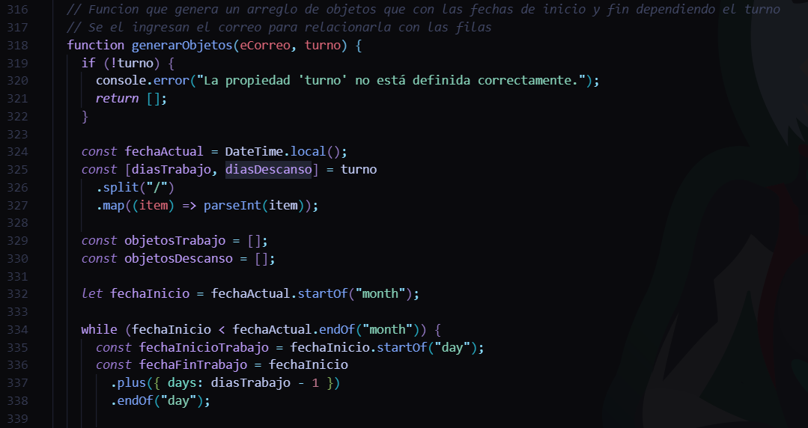
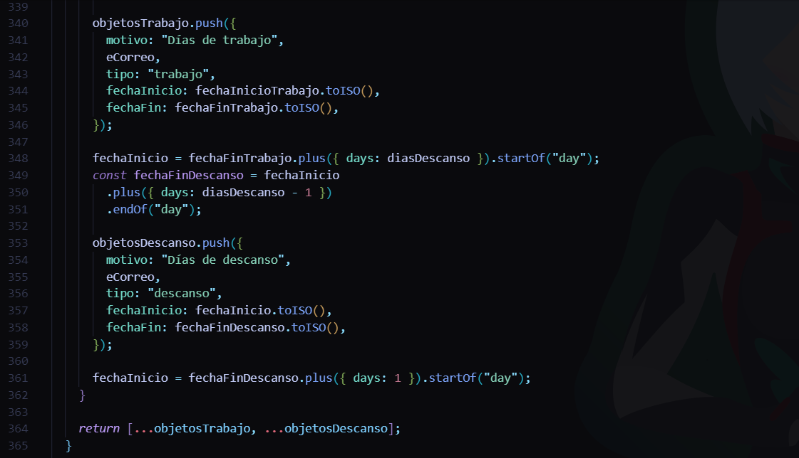
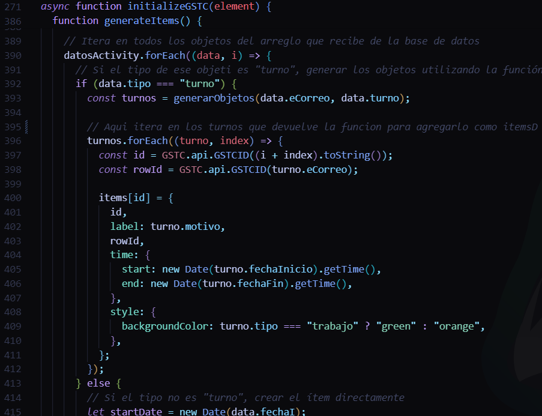

# Info
- Esta hecho con la libreria gantt-schedule-timeline-calendar
- Link de la documentación: [Documentacion](https://gantt-schedule-timeline-calendar.neuronet.io/)
- Link del ejemplo con Next de la documentacion: [Ejemplo](https://github.com/neuronetio/nextjs-gantt-schedule-timeline-calendar-example.git)
- Todo esta en page.js y ya esta conectado a una base de datos en Mongo Atlas

- Funcion que genera los objetos para los items de la gantt si el tipo es turnos

- Aqui se usa

## Intalar
- `npm install`

## Ejecutar
- `npm run dev`